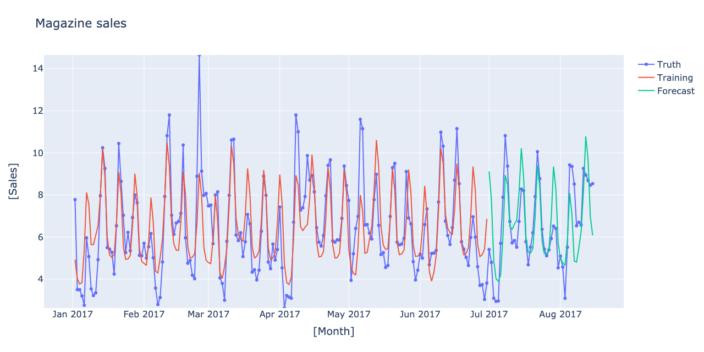
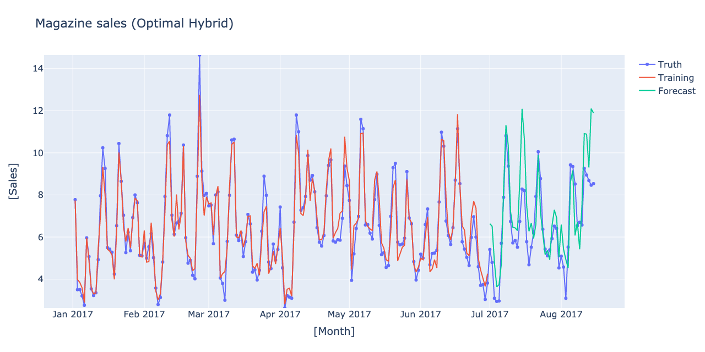
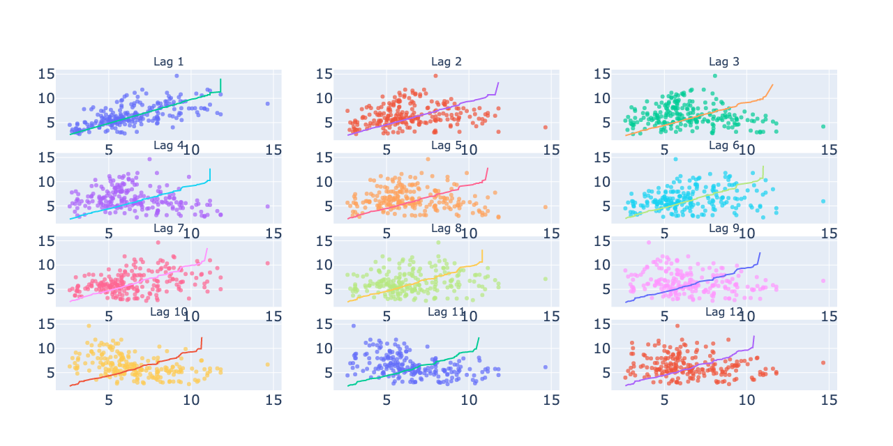

------------------------------------------------------------------
# Flu Prediction  - Time Series Analysis TS2
------------------------------------------------------------------
## How to run the Demo

1. `> python3 time-series-as-features.py`

or 

2. `py2nb time-series-as-features.py`
    It creates a Jupyter Notebook `time-series-as-features.ipynb`.
    Load it on Jupyter and run it there. 
    
------------------------------------------------------------------

## 1. Introduction

 This is a notebook to practice the routine procedures commonly used
 in the time sequence analysis. This notebook is based on the Kaggle
 [Time Series Analysis](https://www.kaggle.com/learn/ti\ me-series)
 offered by Ryan Holbrook.

 A time series consists of __trend__, __seasonality__, __cycles__, and
 __peculiarity__. For each features, we have a procedure to deal with,

 - For __trend__ : Analytical fitting of the baselines (linear, polynomial, etc).
 - For __seasonality__ : Fourier decomposition.
 - For __cycle__ : Lags.
 - For __peculiarity__ : Categorical features.

Here we will learn how to use the lagged features to reproduce cyclic features. 

We also learn some terminology.

 - __Forecast horizon__ : a part of the time series where we perform the forecast.
 - __Forecast origin__ : a point of the time series where the training data ends.
 - __Lead time__ : a part of the time series after the forecast origin, but before
 the forecast horizon starts.

 When we have a forecast horizon longer than one unit time, the prediction requires,
 - __Multioutput model__.

There are a few strategies how to create multiple outputs. 
 
 - __Direct strategy__ : Create one model for each day in the horizon,
 and perform the prediction directly. One needs so many models as
 the forecasting points in the forecast horizon.

 - __Recursive strategy__ :  First train a model to predict the first
 day on the horizon. Only the given training data is used for the training.
 Use that same model to predict the second day in the horizon, but
 now we have one new input from the day before (=the forecast on the first
 day in the horizon).

 _ __DirRec strategy__ : Combination of the two above. Create a model
 to forecast the first day on the horizon. Use that new information
 as ground truth, and create the second model to forecast the second
 day. One needs so many models as the forecasting points in the
 forecast horizon

## 2. Task

 From the historical record of the visits to the doctor's office for
 flu in the past, we will forecast the numbers of such visits in the
 future.

 ## 3. Data

 1. The historical record of the visits to the doctor's office over a
     week, starting from 2009 and ending in 2016.

 2. The data above come with the Google search records related to a
    flu. The keywords and the number of searches are tabulated for
    each week.

------------------------------------------------------------------
## Directory Tree
```
.
├── LICENSE
├── README.md
├── images
│   ├── fig1.png
│   ├── fig3.png
│   ├── fig4.png
│   ├── fig5.png
│   ├── fig6.png
│   └── fig7.png
├── kaggle_tsa
│   ├── __init__.py
│   ├── __pycache__
│   │   ├── __init__.cpython-38.pyc
│   │   └── ktsa.cpython-38.pyc
│   └── ktsa.py
├── requirements.txt
└── time-series-as-features.py

```
* ktsa is a python module that contains functions used in the exercise. 
------------------------------------------------------------------
## Output








```
<class 'pandas.core.frame.DataFrame'>
RangeIndex: 366 entries, 0 to 365
Columns: 131 entries, Week to FluVisits
dtypes: int64(130), object(1)
memory usage: 374.7+ KB
None
                    Week  AInfluenza  AcuteBronchitis  BodyTemperature  \
0  2009-06-29/2009-07-05          36               20               43
1  2009-07-06/2009-07-12          25               19               40
2  2009-07-13/2009-07-19          24               30               45

   BraunThermoscan  BreakAFever  Bronchitis  ChestCold  ColdAndFlu  ColdOrFlu  \
0               27           11          22         16           7          3
1               31           10          21         11           6          8
2               20           12          20         20           6          6

   ColdVersusFlu  ColdVsFlu  ContagiousFlu  CoughFever  CureFlu  CureTheFlu  \
0              8          4              5          15        3           5
1              8          7              6          13        3           1
2              8          4              6          11        3           2

   DangerousFever  DoIHaveTheFlu  EarThermometer  EarlyFluSymptoms  \
0              18              2              29                 7
1              19              5              35                12
2              17              8              29                 9

   Expectorant  ExposedToFlu  FeverCough  FeverFlu  FeverReducer  FightTheFlu  \
0           36            21          15        15            19           13
1           21            16          13        15            18            7
2           24             7          11        13            13            7

   FluAndCold  FluAndFever  FluCare  FluChildren  FluComplications  \
0           7           22        9            5                 3
1           6           20        7            4                 4
2           6           20        9            5                 7

   FluContagiousPeriod  FluContagious  FluCough  FluDuration  FluFever  \
0                    8              5        16           12        15
1                    7              6        14           17        15
2                    9              6        13           16        13

   FluGerms  FluHeadache  FluHowLong  FluInChildren  FluIncubationPeriod  \
0        10           15           6              4                    7
1        13           16           7              4                    8
2         5           14           7              5                    6

   FluIncubation  FluLasts  FluLength  FluMedicine  FluOrCold  FluRecovery  \
0              8        10          9            7          3           13
1              8        10          6            9          8            8
2              6        10          7            7          6           10

   FluRelief  FluRemedies  ...  InfluenzaTreatment  InfluenzaTypeA  \
0         16            9  ...                  13              30
1         10            7  ...                  15              27
2          9            6  ...                  11              25

   IsFluContagious  LowBody  MedicineForFlu  MedicineForTheFlu  \
0                3       52               4                  8
1                4       53               6                  5
2                5       56               8                  7

   NormalBodyTemperature  NormalBody  Oscillococcinum  \
0                     33          45                7
1                     26          36                5
2                     34          45                9

   OverTheCounterFluMedicine  OverTheCounterFlu  PainfulCough  Pneumonia  \
0                         14                 11            10         33
1                          6                  7            19         33
2                          6                  7            19         32

   RapidFlu  ReduceAFever  ReduceFever  RemediesForFlu  RemediesForTheFlu  \
0         8            27           19               6                  6
1         5            23           14               3                  6
2        11            15           17               7                  6

   RespiratoryFlu  Robitussin  SignsOfFlu  SignsOfTheFlu  SinusInfections  \
0               9          22           6              4               27
1               6          21           6              6               26
2              13          19           5              7               28

   Sinus  StrepThroat  Strep  SymptomsOfBronchitis  SymptomsOfFlu  \
0     44           36     43                    15              6
1     42           34     40                    12              5
2     43           32     39                    15              6

   SymptomsOfInfluenza  SymptomsOfPneumonia  SymptomsOfTheFlu  \
0                    8                   19                 4
1                    7                   18                 4
2                    6                   14                 4

   TakingTemperature  Tessalon  TheFluVirus  TheFlu  Thermoscan  TreatFlu  \
0                 26        23            3       3          34         6
1                 23        23            4       3          25        12
2                 30        18            4       3          23         8

   TreatTheFlu  TreatingFlu  TreatingTheFlu  TreatmentForFlu  \
0            5            4              16                6
1            9           13              16                7
2           11           12              16                6

   TreatmentForTheFlu  Tussin  Tussionex  TypeAInfluenza  UpperRespiratory  \
0                  13      25         34              30                25
1                   8      27         32              27                28
2                   9      24         28              25                25

   WalkingPneumonia  WhatToDoIfYouHaveTheFlu  FluVisits
0                24                       15        180
1                29                        9        115
2                25                        9        132

[3 rows x 131 columns]
Lag  1: 0.948
Lag  2: 0.845
Lag  3: 0.733
Lag  4: 0.617
Lag  5: 0.494
Lag  6: 0.374
Lag  7: 0.271
Lag  8: 0.182
Lag  9: 0.106
Lag 10: 0.042
Lag 11: -0.012
Lag 12: -0.058
Train RMSE : 180.72
Test RMSE :  73.52
time-series-as-features.py:216: FutureWarning:

Dropping of nuisance columns in DataFrame reductions (with 'numeric_only=None') is deprecated; in a future version this will raise TypeError.  Select only valid columns before calling the reduction.

Train RMSE : 125.90
Test RMSE : 119.07

```
------------------------------------------------------------------
END

