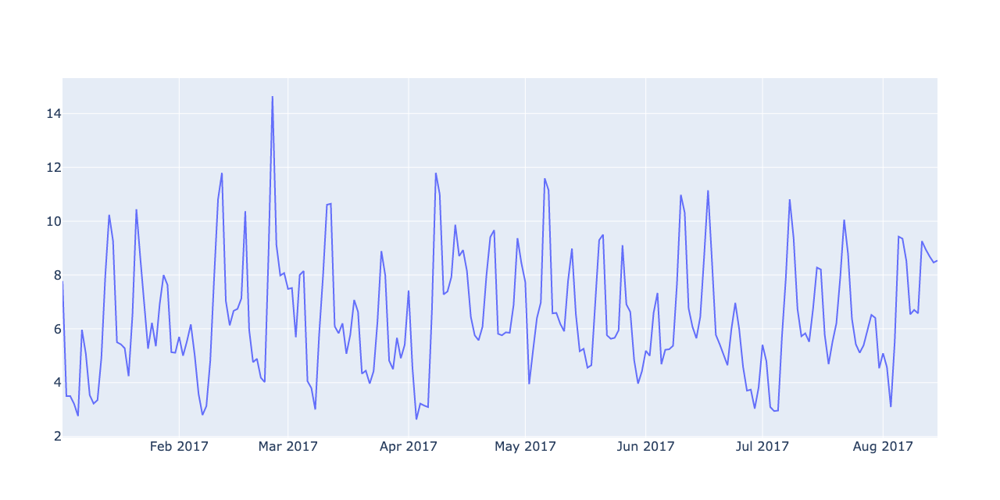
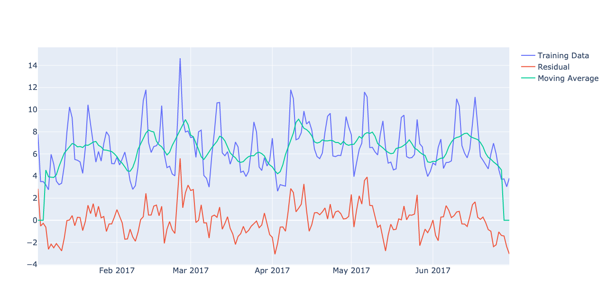
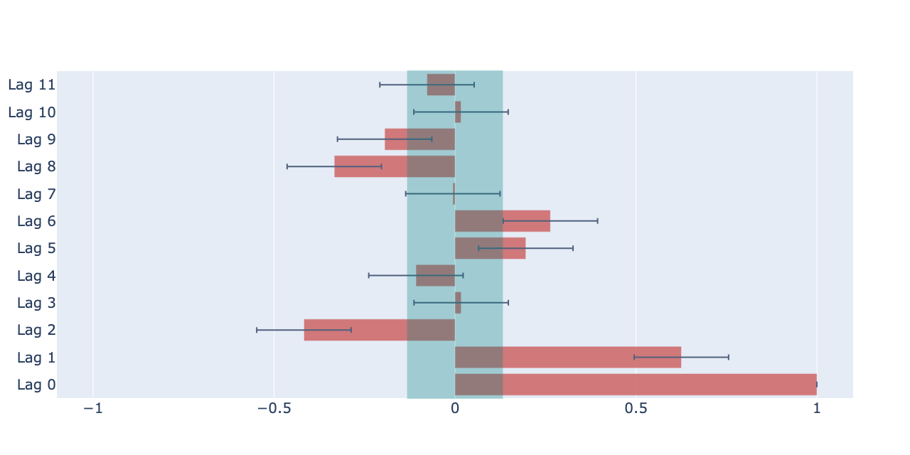
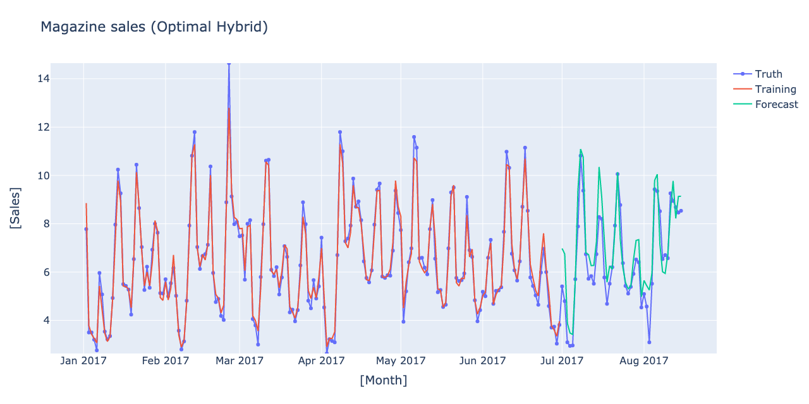

------------------------------------------------------------------
# Sales Prediction  - Time Series Analysis TS3
------------------------------------------------------------------
## How to run the Demo

1. `> python3 sales.py`

or 

2. `py2nb sales.py`
    It creates a Jupyter Notebook `sales.ipynb`.
    Load it on Jupyter and run it there. 
    
------------------------------------------------------------------

 ## 1. Introduction

 This is a notebook to practice the routine procedures
 commonly used in the time series analysis.
 This notebook is based on the Kaggle course [Time Series Analysis](https://www.kaggle.com/learn/time-series)
 offered by Ryan Holbrook.

 We have [the sales record of thousand types of products
 in the supermarket chain 'Favorita' in Ecuador](https://www.kaggle.com/c/store-sales-time-series-forecasting).
 We will make predictions of the sales in the future, using
 the data and the machine learning techniques. We also have
 ancillary data, such as the official holidays in Ecuador,
 and the prices of oil in the country in the same month.
 The main focus in this notebook is __cycles__ in the time series.
 'Lags' is the usual technique to deal with the cycles, but we will
 also try __moving average__ to reproduce the cycles. We will see
 how the two technique work similarly or differently.

 There are two types of machine learning models,
  1. that can learn a trend  [linear regression, etc.] and
  2. that cannot learn a trend [xgboost, decision trees, etc.],
 because the latter does not learn an 'extrapolation'.

 In order to make the most of the machine learning, we will combine
 both, i.e., we will use a linear model to extrapolate the trend of the
 target in the first stage, and use more sophisticated models to reproduce
 the  residuals in the second stage.  This multi-stage strategy is called
 __hybrid models__.  In this notebook we will first combine a
 linear regressor model with `xgboost`, and continue to mix other models
 as  well.

 ## 2. Task

 1. Concentrate on the sales of magazines. Keep in mind
 the following components,

    + seasonality
    + lags
    + partial autocorrelation function
    + ancillary data for the number of the products on promotion

 Note that lags contains seasonality, as 7-days (weekly) trend shows
 up exactly as a correlation of the 7-days frequency (=7 days lag). In
 order to isolate the lagged features (that are not seasonality), we
 will first remove the seasonality from the target feature.


 ## 3. Data
 1. [sales record in supermarket-chain 'Favorita' in Ecuador](https://www.kaggle.com/c/store-sales-time-series-forecasting).


------------------------------------------------------------------
## Directory Tree
```
.
├── LICENSE
├── README.md
├── images
│   ├── fig1.png
│   ├── fig10.png
│   ├── fig2.png
│   ├── fig3.png
│   ├── fig4.png
│   ├── fig5.png
│   ├── fig6.png
│   ├── fig7.png
│   ├── fig8.png
│   └── fig9.png
├── kaggle_tsa
│   ├── __init__.py
│   ├── __pycache__
│   │   ├── __init__.cpython-38.pyc
│   │   └── ktsa.cpython-38.pyc
│   └── ktsa.py
├── requirements.txt
├── sales.ipynb
└── sales.py

3 directories, 19 files

```
* ktsa is a python module that contains functions used in the exercise. 
------------------------------------------------------------------
## Output










```
<class 'pandas.core.frame.DataFrame'>
RangeIndex: 3000888 entries, 0 to 3000887
Data columns (total 6 columns):
 #   Column       Dtype  
---  ------       -----  
 0   id           int64  
 1   date         object 
 2   store_nbr    int64  
 3   family       object 
 4   sales        float64
 5   onpromotion  float64
dtypes: float64(2), int64(2), object(2)
memory usage: 137.4+ MB
None
<class 'pandas.core.frame.DataFrame'>
PeriodIndex: 226 entries, 2017-01-02 to 2017-08-15
Freq: D
Data columns (total 66 columns):
 #   Column                                     Non-Null Count  Dtype  
---  ------                                     --------------  -----  
 0   (sales, AUTOMOTIVE)                        226 non-null    float64
 1   (sales, BABY CARE)                         226 non-null    float64
 2   (sales, BEAUTY)                            226 non-null    float64
 3   (sales, BEVERAGES)                         226 non-null    float64
 4   (sales, BOOKS)                             226 non-null    float64
 5   (sales, BREAD/BAKERY)                      226 non-null    float64
 6   (sales, CELEBRATION)                       226 non-null    float64
 7   (sales, CLEANING)                          226 non-null    float64
 8   (sales, DAIRY)                             226 non-null    float64
 9   (sales, DELI)                              226 non-null    float64
 10  (sales, EGGS)                              226 non-null    float64
 11  (sales, FROZEN FOODS)                      226 non-null    float64
 12  (sales, GROCERY I)                         226 non-null    float64
 13  (sales, GROCERY II)                        226 non-null    float64
 14  (sales, HARDWARE)                          226 non-null    float64
 15  (sales, HOME AND KITCHEN I)                226 non-null    float64
 16  (sales, HOME AND KITCHEN II)               226 non-null    float64
 17  (sales, HOME APPLIANCES)                   226 non-null    float64
 18  (sales, HOME CARE)                         226 non-null    float64
 19  (sales, LADIESWEAR)                        226 non-null    float64
 20  (sales, LAWN AND GARDEN)                   226 non-null    float64
 21  (sales, LINGERIE)                          226 non-null    float64
 22  (sales, LIQUOR,WINE,BEER)                  226 non-null    float64
 23  (sales, MAGAZINES)                         226 non-null    float64
 24  (sales, MEATS)                             226 non-null    float64
 25  (sales, PERSONAL CARE)                     226 non-null    float64
 26  (sales, PET SUPPLIES)                      226 non-null    float64
 27  (sales, PLAYERS AND ELECTRONICS)           226 non-null    float64
 28  (sales, POULTRY)                           226 non-null    float64
 29  (sales, PREPARED FOODS)                    226 non-null    float64
 30  (sales, PRODUCE)                           226 non-null    float64
 31  (sales, SCHOOL AND OFFICE SUPPLIES)        226 non-null    float64
 32  (sales, SEAFOOD)                           226 non-null    float64
 33  (onpromotion, AUTOMOTIVE)                  226 non-null    float64
 34  (onpromotion, BABY CARE)                   226 non-null    float64
 35  (onpromotion, BEAUTY)                      226 non-null    float64
 36  (onpromotion, BEVERAGES)                   226 non-null    float64
 37  (onpromotion, BOOKS)                       226 non-null    float64
 38  (onpromotion, BREAD/BAKERY)                226 non-null    float64
 39  (onpromotion, CELEBRATION)                 226 non-null    float64
 40  (onpromotion, CLEANING)                    226 non-null    float64
 41  (onpromotion, DAIRY)                       226 non-null    float64
 42  (onpromotion, DELI)                        226 non-null    float64
 43  (onpromotion, EGGS)                        226 non-null    float64
 44  (onpromotion, FROZEN FOODS)                226 non-null    float64
 45  (onpromotion, GROCERY I)                   226 non-null    float64
 46  (onpromotion, GROCERY II)                  226 non-null    float64
 47  (onpromotion, HARDWARE)                    226 non-null    float64
 48  (onpromotion, HOME AND KITCHEN I)          226 non-null    float64
 49  (onpromotion, HOME AND KITCHEN II)         226 non-null    float64
 50  (onpromotion, HOME APPLIANCES)             226 non-null    float64
 51  (onpromotion, HOME CARE)                   226 non-null    float64
 52  (onpromotion, LADIESWEAR)                  226 non-null    float64
 53  (onpromotion, LAWN AND GARDEN)             226 non-null    float64
 54  (onpromotion, LINGERIE)                    226 non-null    float64
 55  (onpromotion, LIQUOR,WINE,BEER)            226 non-null    float64
 56  (onpromotion, MAGAZINES)                   226 non-null    float64
 57  (onpromotion, MEATS)                       226 non-null    float64
 58  (onpromotion, PERSONAL CARE)               226 non-null    float64
 59  (onpromotion, PET SUPPLIES)                226 non-null    float64
 60  (onpromotion, PLAYERS AND ELECTRONICS)     226 non-null    float64
 61  (onpromotion, POULTRY)                     226 non-null    float64
 62  (onpromotion, PREPARED FOODS)              226 non-null    float64
 63  (onpromotion, PRODUCE)                     226 non-null    float64
 64  (onpromotion, SCHOOL AND OFFICE SUPPLIES)  226 non-null    float64
 65  (onpromotion, SEAFOOD)                     226 non-null    float64
dtypes: float64(66)
memory usage: 118.3 KB
None
Train RMSE:   1.42
Test RMSE :   1.51
Train RMSE:   1.42
Test RMSE :   1.51
LinearRegression XGBRegressor
Train RMSE:   0.39
Test RMSE :   2.00
#====================
LinearRegression ExtraTreesRegressor
Train RMSE:   0.39
Test RMSE :   1.78
#====================
LinearRegression RandomForestRegressor
Train RMSE:   0.58
Test RMSE :   1.73
#====================
LinearRegression KNeighborsRegressor
Train RMSE:   1.22
Test RMSE :   1.47
#====================
LinearRegression MLPRegressor
Train RMSE:   1.55
Test RMSE :   1.65
#====================
ElasticNet XGBRegressor
Train RMSE:   0.34
Test RMSE :   1.85
#====================
ElasticNet ExtraTreesRegressor
Train RMSE:   0.34
Test RMSE :   1.51
#====================
ElasticNet RandomForestRegressor
Train RMSE:   0.55
Test RMSE :   1.46
#====================
ElasticNet KNeighborsRegressor
Train RMSE:   1.55
Test RMSE :   1.57
#====================
ElasticNet MLPRegressor
Train RMSE:   1.66
Test RMSE :   1.52
#====================
Lasso XGBRegressor
Train RMSE:   0.34
Test RMSE :   1.89
#====================
Lasso ExtraTreesRegressor
Train RMSE:   0.34
Test RMSE :   1.50
#====================
Lasso RandomForestRegressor
Train RMSE:   0.55
Test RMSE :   1.41
#====================
Lasso KNeighborsRegressor
Train RMSE:   1.55
Test RMSE :   1.57
#====================
Lasso MLPRegressor
Train RMSE:   2.28
Test RMSE :   2.00
#====================
Ridge XGBRegressor
Train RMSE:   0.38
Test RMSE :   1.95
#====================
Ridge ExtraTreesRegressor
Train RMSE:   0.38
Test RMSE :   1.76
#====================
Ridge RandomForestRegressor
Train RMSE:   0.58
Test RMSE :   1.69
#====================
Ridge KNeighborsRegressor
Train RMSE:   1.20
Test RMSE :   1.43
#====================
Ridge MLPRegressor
Train RMSE:   1.25
Test RMSE :   1.47
#====================
    train_rmse  test_rmse                                combination
12    0.545914   1.414317             (Lasso, RandomForestRegressor)
18    1.203847   1.429710               (Ridge, KNeighborsRegressor)
7     0.546296   1.461796        (ElasticNet, RandomForestRegressor)
3     1.216587   1.468486    (LinearRegression, KNeighborsRegressor)
19    1.253913   1.470444                      (Ridge, MLPRegressor)
11    0.336059   1.501167               (Lasso, ExtraTreesRegressor)
6     0.336753   1.514628          (ElasticNet, ExtraTreesRegressor)
9     1.664506   1.521186                 (ElasticNet, MLPRegressor)
13    1.551019   1.570114               (Lasso, KNeighborsRegressor)
8     1.551942   1.571998          (ElasticNet, KNeighborsRegressor)
4     1.552031   1.653202           (LinearRegression, MLPRegressor)
17    0.578419   1.691845             (Ridge, RandomForestRegressor)
2     0.583611   1.729860  (LinearRegression, RandomForestRegressor)
16    0.378341   1.761713               (Ridge, ExtraTreesRegressor)
1     0.387854   1.784448    (LinearRegression, ExtraTreesRegressor)
5     0.337243   1.849422                 (ElasticNet, XGBRegressor)
10    0.336332   1.892502                      (Lasso, XGBRegressor)
15    0.379105   1.951982                      (Ridge, XGBRegressor)
0     0.388341   1.996977           (LinearRegression, XGBRegressor)
14    2.284090   1.997931                      (Lasso, MLPRegressor)
[0.6245790119145538, 0.13734411552314355, -0.1309931205412236, -0.22093807393146567, -0.08949856151574656, 0.21340551336243196, 0.36520372649331645, 0.13668956895948983, -0.22308314162845908, -0.4003480809430395, -0.407608542151302, -0.16674424608455676]
<class 'pandas.core.frame.DataFrame'>
PeriodIndex: 226 entries, 2017-01-02 to 2017-08-15
Freq: D
Data columns (total 16 columns):
 #   Column         Non-Null Count  Dtype  
---  ------         --------------  -----  
 0   const          226 non-null    float64
 1   trend          226 non-null    float64
 2   s(2,7)         226 non-null    float64
 3   s(3,7)         226 non-null    float64
 4   s(4,7)         226 non-null    float64
 5   s(5,7)         226 non-null    float64
 6   s(6,7)         226 non-null    float64
 7   s(7,7)         226 non-null    float64
 8   sin(1,freq=M)  226 non-null    float64
 9   cos(1,freq=M)  226 non-null    float64
 10  sin(2,freq=M)  226 non-null    float64
 11  cos(2,freq=M)  226 non-null    float64
 12  sin(3,freq=M)  226 non-null    float64
 13  cos(3,freq=M)  226 non-null    float64
 14  sin(4,freq=M)  226 non-null    float64
 15  cos(4,freq=M)  226 non-null    float64
dtypes: float64(16)
memory usage: 30.0 KB
None
<class 'pandas.core.frame.DataFrame'>
PeriodIndex: 226 entries, 2017-01-02 to 2017-08-15
Freq: D
Data columns (total 19 columns):
 #   Column              Non-Null Count  Dtype  
---  ------              --------------  -----  
 0   y_lag_1             226 non-null    float64
 1   y_lag_2             226 non-null    float64
 2   y_lag_3             226 non-null    float64
 3   y_lag_4             226 non-null    float64
 4   y_lag_5             226 non-null    float64
 5   y_lag_6             226 non-null    float64
 6   y_lag_7             226 non-null    float64
 7   y_lag_8             226 non-null    float64
 8   y_lag_9             226 non-null    float64
 9   y_lag_10            226 non-null    float64
 10  y_lag_1             226 non-null    float64
 11  y_lag_2             226 non-null    float64
 12  y_step_0            226 non-null    float64
 13  y_step_1            226 non-null    float64
 14  (sales, MAGAZINES)  226 non-null    float64
 15  (sales, MAGAZINES)  226 non-null    float64
 16  (sales, MAGAZINES)  226 non-null    float64
 17  (sales, MAGAZINES)  226 non-null    float64
 18  day                 226 non-null    int64  
dtypes: float64(18), int64(1)
memory usage: 35.3 KB
None
LinearRegression XGBRegressor
Train RMSE:   0.00
Test RMSE :   1.28
#====================
LinearRegression ExtraTreesRegressor
Train RMSE:   0.00
Test RMSE :   1.22
#====================
LinearRegression RandomForestRegressor
Train RMSE:   0.37
Test RMSE :   1.26
#====================
LinearRegression KNeighborsRegressor
Train RMSE:   0.83
Test RMSE :   1.06
#====================
LinearRegression MLPRegressor
Train RMSE:   0.87
Test RMSE :   1.78
#====================
ElasticNet XGBRegressor
Train RMSE:   0.00
Test RMSE :   1.18
#====================
ElasticNet ExtraTreesRegressor
Train RMSE:   0.00
Test RMSE :   1.00
#====================
ElasticNet RandomForestRegressor
Train RMSE:   0.35
Test RMSE :   0.99
#====================
ElasticNet KNeighborsRegressor
Train RMSE:   1.01
Test RMSE :   1.38
#====================
ElasticNet MLPRegressor
Train RMSE:   0.96
Test RMSE :   2.64
#====================
Lasso XGBRegressor
Train RMSE:   0.00
Test RMSE :   1.15
#====================
Lasso ExtraTreesRegressor
Train RMSE:   0.00
Test RMSE :   1.02
#====================
Lasso RandomForestRegressor
Train RMSE:   0.35
Test RMSE :   0.93
#====================
Lasso KNeighborsRegressor
Train RMSE:   1.01
Test RMSE :   1.38
#====================
Lasso MLPRegressor
Train RMSE:   1.04
Test RMSE :   3.26
#====================
Ridge XGBRegressor
Train RMSE:   0.00
Test RMSE :   1.35
#====================
Ridge ExtraTreesRegressor
Train RMSE:   0.00
Test RMSE :   1.17
#====================
Ridge RandomForestRegressor
Train RMSE:   0.37
Test RMSE :   1.23
#====================
Ridge KNeighborsRegressor
Train RMSE:   0.83
Test RMSE :   1.04
#====================
Ridge MLPRegressor
Train RMSE:   2.60
Test RMSE :   2.72
#====================
      train_rmse  test_rmse                                combination
12  3.485593e-01   0.930302             (Lasso, RandomForestRegressor)
7   3.483195e-01   0.987056        (ElasticNet, RandomForestRegressor)
6   3.316659e-15   1.004280          (ElasticNet, ExtraTreesRegressor)
11  3.245027e-15   1.021539               (Lasso, ExtraTreesRegressor)
18  8.286350e-01   1.042135               (Ridge, KNeighborsRegressor)
3   8.289711e-01   1.063415    (LinearRegression, KNeighborsRegressor)
10  6.944730e-04   1.146492                      (Lasso, XGBRegressor)
16  1.817212e-15   1.171134               (Ridge, ExtraTreesRegressor)
5   6.528949e-04   1.176284                 (ElasticNet, XGBRegressor)
1   1.986855e-15   1.224405    (LinearRegression, ExtraTreesRegressor)
17  3.697032e-01   1.229536             (Ridge, RandomForestRegressor)
2   3.689458e-01   1.260802  (LinearRegression, RandomForestRegressor)
0   7.337522e-04   1.284749           (LinearRegression, XGBRegressor)
15  6.994909e-04   1.354764                      (Ridge, XGBRegressor)
8   1.010203e+00   1.375272          (ElasticNet, KNeighborsRegressor)
13  1.009634e+00   1.379707               (Lasso, KNeighborsRegressor)
4   8.664023e-01   1.782518           (LinearRegression, MLPRegressor)
9   9.632473e-01   2.641739                 (ElasticNet, MLPRegressor)
19  2.598103e+00   2.717995                      (Ridge, MLPRegressor)
14  1.043199e+00   3.262452                      (Lasso, MLPRegressor)


```
------------------------------------------------------------------
END

